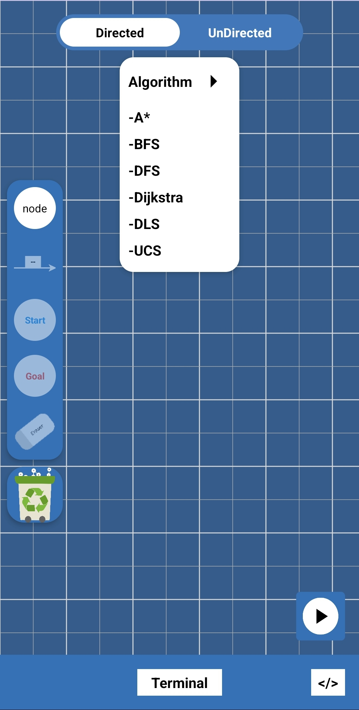
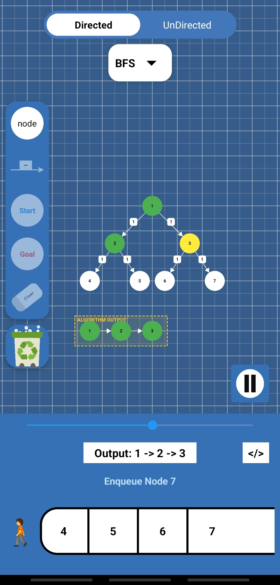
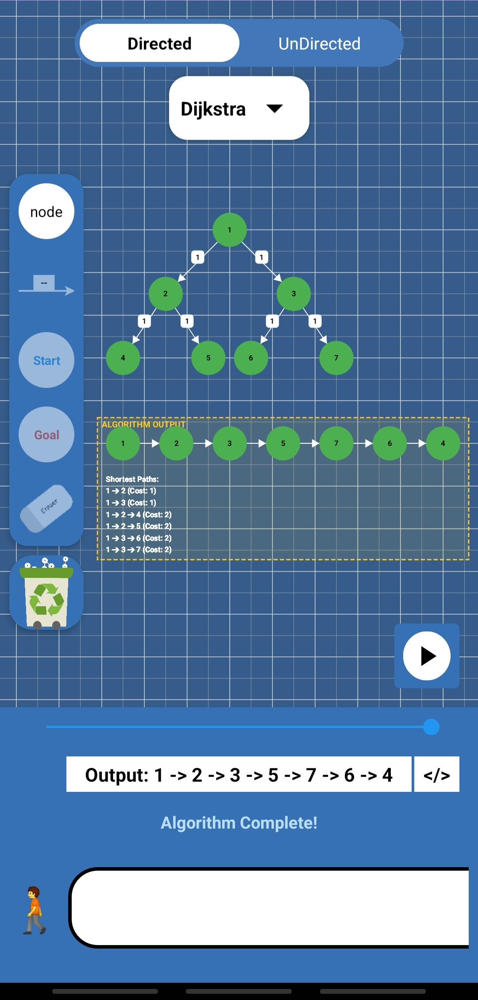
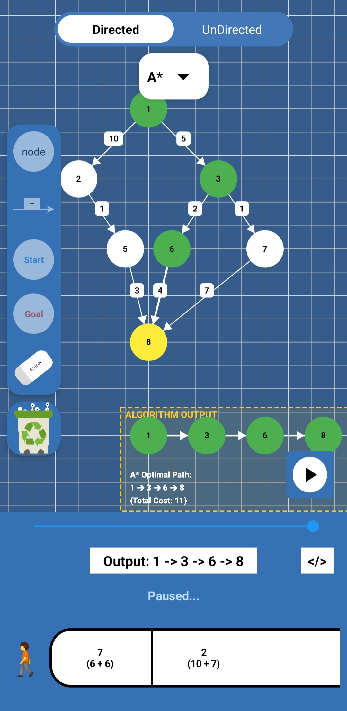

# Graph-Tree-Algo Simulator


A **high-performance interactive Android visualizer** designed to help students and developers master **graph theory and tree traversal algorithms** through real-time simulation.

Users can construct graphs interactively and observe how algorithms explore nodes, update costs, and manipulate internal data structures such as **queues, stacks, and priority queues**.

---

# 📱 App Screenshots

## Graph Blueprint Canvas


## BFS Execution Visualization


## Dijkstra Shortest Path


## A*


---

# ✨ Key Features

## Interactive Blueprint Canvas

Create graph structures visually in real time.

- **Node Mode** – tap to create vertices
- **Edge Mode** – connect vertices to create edges
- Real-time rendering using a **custom Canvas engine**

---

## Dynamic Edge Weighting

Modify edge weights instantly.

- Premium weight input dialog
- Observe how **pathfinding costs change dynamically**

---

## Step-by-Step Playback Engine

Custom **DVD-style algorithm playback system**.

Features:

- Play
- Pause
- Timeline scrubbing
- Step-by-step debugging of algorithm states

---

## Real-Time Terminal Visualization

A dedicated animation area visualizes the internal data structures used by algorithms.

Includes:

- Stack visualization
- Queue visualization
- Priority Queue visualization

Watch how elements are **inserted, removed, and reordered** as the algorithm executes.

---

## Cinematic Camera System

Auto-framing camera technology:

- Automatically pans and zooms
- Keeps algorithm progress centered
- Highlights final paths and results

---

# 🧠 Supported Algorithms

| Category | Algorithm | Visualization |
|--------|--------|--------|
| Uninformed Search | Breadth-First Search (BFS) | Queue |
| Uninformed Search | Depth-First Search (DFS) | Stack |
| Uninformed Search | Depth Limited Search (DLS) | Stack with depth limit |
| Informed Search | A* Search | Priority Queue (F = G + H) |
| Informed Search | Uniform Cost Search (UCS) | Priority Queue |
| Shortest Path | Dijkstra’s Algorithm | Priority Queue |

---

# 🛠 Tech Stack

| Component | Technology |
|------|------|
| Language | Java |
| UI Framework | Android XML |
| Rendering | Custom View + Canvas API |
| Architecture | Modular Factory Pattern |
| IDE | Android Studio |

---

# 🏗 Architecture

The project uses a **modular architecture** allowing algorithms to be easily added or extended.

Key design concepts:

- **Algorithm Factory Pattern**
- **Separation of Rendering and Logic**
- **Custom Animation Playback Engine**
- **Graph Data Model Abstraction**

---

# 🚀 Getting Started

## 1️⃣ Clone the Repository

```bash
git clone https://github.com/Sam3305/Graph-Tree-Algo-Simulator.git
>2️⃣ Open in Android Studio

Open Android Studio

Select Open Existing Project

Choose the cloned repository folder

Wait for Gradle Sync

3️⃣ Run the App

Deploy to:

Physical Android device
or

Android Emulator (API 31+ recommended)

📂 Project Structure
Graph-Tree-Algo-Simulator
│
├── algorithms/
│   ├── BFS.java
│   ├── DFS.java
│   ├── Dijkstra.java
│   └── AStar.java
│
├── model/
│   ├── Node.java
│   ├── Edge.java
│   └── Graph.java
│
├── view/
│   └── GraphView.java
│
├── TerminalManager.java
├── PlaybackManager.java
│
└── MainActivity.java
🎯 Educational Purpose

This simulator helps users understand:

Graph traversal behavior

Shortest path computation

Cost propagation

Data structure evolution during algorithms

It is particularly useful for:

Computer Science students

Algorithm learners

Interview preparation

Teaching demonstrations
